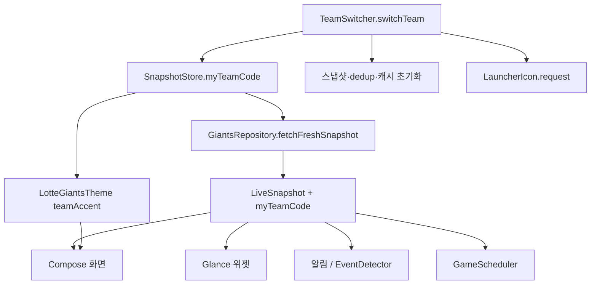
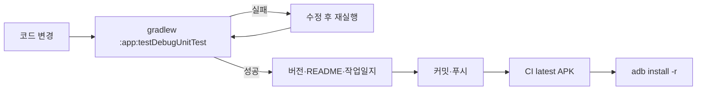

# 내 팀 전환 기능 (2.0.2 / 2002)

**선택 후보 A~G 전부 포함** (2026-09-10 확정).

## 이미 끝난 것

### 2.0.0
- 앱 이름 **집관**, 홈 화면 alias 라벨 `집관 사직` 등 ([strings.xml](app/src/main/res/values/strings.xml))
- 10구단 구장 배지 런처 아이콘 + [LauncherIcon.kt](app/src/main/java/com/bossxor/lottegiants/LauncherIcon.kt) (`request` / `applyPending`, `MainActivity.onStop`에서 적용). **호출부만 없음**
- Wear 모듈 삭제, 위젯 추가 화면 중립화
- 백업 `v1.3.87`

### 2.0.1 (계획 밖에 먼저 반영됨)
- 위젯 선발·잔여 글자 확대, 구장명(사직·잠실 등) 표시 — 컴팩트·라이브·종료·취소
- 팀 전환 때 위젯 문구/색만 `myTeamCode`로 바꾸면 되고, 글자 크기·구장 표시는 다시 손대지 않는다

이번 작업은 **데이터·알림·위젯·테마가 실제로 팀을 따라가게** 하는 본체다.

## 결론 먼저

기반은 깔려 있다. [Models.kt](app/src/main/java/com/bossxor/lottegiants/domain/Models.kt)에 10구단 코드·이름·로고·Keubo slug·강조색·홈구장이 있고, `LotteGameInfo`의 `focusTeamCode`/`toLotteBase(focusTeamCode=…)`로 **이름만 롯데인 “내 팀 좌표계”**를 채울 수 있다. 필드명(`lotteScore` 등)은 **그대로** 둔다 — 스냅샷 JSON 호환.

막힌 곳:

- `GiantsRepository.fetchFreshSnapshot()`이 `involvesLotte()`로 전부 롯데를 고른다
- 알림·위젯·화면에 `"롯데"` / `LOTTE_LOGO_URL` / `LotteRed`가 박혀 있다
- 팀을 바꾸는 순간 스냅샷·중복알림 키·알람·**런처 아이콘**을 갈아엎는 루틴이 없다

## 팀 코드가 흐르는 길

위젯·알림은 CompositionLocal을 못 쓰므로 **`LiveSnapshot.myTeamCode`가 필수**다. `ignoreUnknownKeys = true`라 필드 추가는 기존 저장과 호환된다.

## 1단계 — 저장소와 전환 루틴

[SnapshotStore.kt](app/src/main/java/com/bossxor/lottegiants/data/SnapshotStore.kt)

- `KEY_MY_TEAM = my_team_code`, `myTeamCodeFlow` (없으면 `LOTTE_TEAM_CODE`)
- `UserSettingsBackup.myTeam` + export/import

신규 `data/TeamSwitcher.kt`:

- `setMyTeamCode(code)`
- DataStore에서 이전 팀 잔재 삭제: `live_snapshot`, `notified_roster_keys`, `notified_lineup_state`, `last_live_notify_key`, `preferred_live_game_id`, `dismissed_finished_live_game_id`, `notified_cancel_game_id`, `notified_end_game_id`, `last_race_fingerprint`
- `repo.clearTeamCaches()` — memorySnapshot, Ruta·중계 캐시 (일정·순위 캐시는 유지)
- `refreshSnapshot(force)` → 알람 재등록 → Live/AlertWatch 재평가 → 위젯 갱신
- **`LauncherIcon.request(code)`** — 앱이 백그라운드로 갈 때 홈 아이콘·라벨이 구장 배지로 바뀜

## 2단계 — Repository 파라미터화

[GiantsRepository.kt](app/src/main/java/com/bossxor/lottegiants/data/GiantsRepository.kt) 진입에서 `val focus = store.myTeamCode()`.

- `involvesLotte()` → `involvesTeam(focus)` (KBO 쪽 `involvesTeam`은 이미 있음. 네이버 `GameDto`용만 추가)
- `pickKboLotte` / `pickNaverLotte` → focus 인자
- `toLotteBase()` 호출에 focus 전달
- 순위·팀카드·라인업 알림·등말소·동명이인 우선을 focus로
- `LiveSnapshot(..., myTeamCode = focus)`
- [Models.kt](app/src/main/java/com/bossxor/lottegiants/domain/Models.kt) `toRaceMiniGame`의 `"롯데"` / `LOTTE_TEAM_CODE` 하드코딩도 focus로

## 3단계 — 알림·위젯·스케줄러

- [ScoreAlerts.kt](app/src/main/java/com/bossxor/lottegiants/domain/ScoreAlerts.kt) — `"$teamName 득점!"` 등
- [EventDetector.kt](app/src/main/java/com/bossxor/lottegiants/live/EventDetector.kt) — `game.focusName()`, 홈런 판별도 focus 이름
- [NotificationHelper.kt](app/src/main/java/com/bossxor/lottegiants/live/NotificationHelper.kt) — 문구·`teamAccentColor`. **채널 ID는 그대로**
- [SnapshotStore.kt](app/src/main/java/com/bossxor/lottegiants/data/SnapshotStore.kt) `NotificationType` — 설정 화면 설명의 `"롯데가 득점…"` → 팀명 동적 (또는 `"내 팀이 득점…"`)
- [MagicNumber.kt](app/src/main/java/com/bossxor/lottegiants/domain/MagicNumber.kt) — `raceChangeCause` 등 `"롯데 승…"` 폴백을 focus로
- [LotteWidget.kt](app/src/main/java/com/bossxor/lottegiants/widget/LotteWidget.kt) — `snap.myTeamCode` 로고·문구·색 + **(A)** BeforeWide/LiveWide/EndedWide 등 `"롯데"` → `focusName()`
- [GameScheduler.kt](app/src/main/java/com/bossxor/lottegiants/live/GameScheduler.kt) — LT/`롯데` 판별 → `involvesTeam(myTeam)`

## 4단계 — 테마·화면 문구

[Theme.kt](app/src/main/java/com/bossxor/lottegiants/ui/Theme.kt) — `LocalTeamAccent`, `LotteGiantsTheme(teamCode)`, `LotteRed` 직접 참조를 `teamAccent()`로. `WinGreen`/`LoseRed`는 유지.

**브랜딩 (2.0.0과 맞춤):**

- 앱 타이틀·공유 해시태그 = **집관** 고정 (팀별로 안 바꿈)
- 히어로 워터마크 = 구장 영문 (`SAJIK` / `JAMSIL` / `DAEGU` …) — 런처 배지와 동일
- 홈 화면 라벨은 이미 alias (`집관 사직` …)

화면:

- [LiveScreen.kt](app/src/main/java/com/bossxor/lottegiants/ui/screens/LiveScreen.kt) — `"← 롯데"`, `NextGameContent`의 `LOTTE_LOGO_URL`/`"사직 · 홈"`, **`isFocusLotte()` 게이트 해제** (하이라이트·승률·클립이 내 팀이면 뜨게)
- Standings / Results / MainViewModel / MainActivity — 롯데 고정 정렬·트렌드·진입 코드
- **(C)** 결과 탭 `resultsTeamCode` 초기값 = `myTeamCode` (지금은 LT 고정)
- 날씨 fallback — [Stadiums.kt](app/src/main/java/com/bossxor/lottegiants/domain/Stadiums.kt) 미매칭 시 **내 팀 홈구장** (지금은 사직 고정)

## 5단계 — 설정 UI

[SettingsScreen.kt](app/src/main/java/com/bossxor/lottegiants/ui/screens/SettingsScreen.kt) **화면 테마 바로 위**.

- 한 줄: 팀 로고 + 정식명 + `변경`
- 다이얼로그 10구단 → 확인 문구 → `TeamSwitcher.switchTeam` (+ 런처 request)
- **(B)** 온보딩·집관 안내에 “설정에서 내 팀을 바꿀 수 있다” 한 줄
- **(D)** 팀 전환 확인에 즐겨찾기 선수가 다른 팀일 수 있다는 안내
- **(G)** 설정 백업 import 후에도 `LauncherIcon.request(myTeamCode)` 호출

## 6단계 — 팀 히스토리 (추가)

[LotteHistory.kt](app/src/main/java/com/bossxor/lottegiants/domain/LotteHistory.kt) → `TeamHistory.byCode`.

- 섹션은 간단히: 구단 개요 · KS 우승/준우승 · 영구결번 · 홈구장 가이드 · 응원가 한 줄
- [TeamHistoryScreen.kt](app/src/main/java/com/bossxor/lottegiants/ui/screens/TeamHistoryScreen.kt)의 `if (isLotte)` 제거
- API 없음. 손으로 쓰되 깊이보다 **빈 화면만 피하면** 됨

## 7단계 — Keubo 팀카드·Wear 정리 (선택 확정분)

- **(E)** 10구단 Keubo slug로 team-card 프로브. 실패·404면 빈 카드 UI (크래시·스피너 고착 금지)
- **(F)** 디스크에 남은 `wear/` 빈 폴더·잔여 제거 (빌드에서 이미 빠졌으면 파일만 정리)

## 손대지 않는 것

- `viewingGame` / `overlayTeamCode` / `resultsTeamCode` — 이미 임의 팀 축
- 알림 채널 ID·이름 (이미 팀 중립)
- `sajik://` 딥링크, 패키지명, GitHub 리포명
- 공유 해시태그 `#집관` (앱 브랜드로 유지)

## 검증 · 배포 순서 (필수)

**유닛 테스트가 통과하기 전에는 커밋도 adb 설치도 하지 않는다.**

1. `.\scripts\env.ps1` 후 `L:\`에서 `.\gradlew.bat :app:testDebugUnitTest`
2. 실패하면 고치고 다시 돌린다. **커밋·푸시·adb 금지**
3. 통과 후에만 `versionName`/`versionCode`, README·작업일지 갱신
4. 커밋·푸시 → CI `latest` 완료 확인 → `adb install -r`
5. 기기에서 롯데→두산 전환 후 히어로·순위·위젯(팀명)·알림·홈 아이콘(`집관 잠실`)·결과 탭 기본 필터·즐겨찾기 안내·백업 복원 후 아이콘 확인, 다시 롯데

유닛 범위: `involvesTeam`, 워터마크 매핑, 알림 문구, DataStore 삭제 키 목록, `LauncherIcon.normalize`, ScoreAlerts/MagicNumber 팀명 파라미터, `resultsTeamCode` 초기값, 위젯 `focusName`

기존 사용자: 키 없으면 롯데 기본 → **업데이트 후 변화 없음**

버전 `2.0.2` / `versionCode` **2002**.

히스토리·매직넘버·레이스 문구는 **빼지 않는다.** 팀을 바꿨는데 그 기능만 롯데에 묶여 있으면 전환이 반쪽이라서, 본체와 같이 맞춘다.

## 본체에 이미 포함된 보강분

| 항목 | 이유 | 난이도 |
|------|------|--------|
| `LauncherIcon.request` 연결 | 2.0.0 인프라가 호출만 안 됨 | low |
| `NotificationType` 롯데 문구 | 설정 알림 설명이 팀 안 따라감 | low |
| `isFocusLotte` 게이트 해제 | 하이라이트·승률이 롯데만 | med |
| 사직 날씨 폴백 → 내 팀 홈 | 미매칭 시 잘못된 날씨 | low |
| MagicNumber / toRaceMiniGame | 레이스 알림·미니게임이 롯데 고정 | med |
| NextGameContent 로고·홈 문구 | 다음 경기 카드가 안 따라감 | low |
| 팀 히스토리 9팀 간단 작성 | 다른 팀이면 시즌 카드만 뜸 | med |

## 선택 후보 → 전부 채택 (2026-09-10)

| id | 후보 | 반영 위치 | 난이도 |
|----|------|-----------|--------|
| A | 위젯 `"롯데"` → `focusName()` | 3단계 widget | low |
| B | 온보딩·설정 안내 문구 | 5단계 settings-ui | low |
| C | 결과 탭 기본 필터 = 내 팀 | 4단계 ui-strings | low |
| D | 즐겨찾기 팀 전환 안내 | 5단계 settings-ui | low |
| E | Keubo 팀카드 실존 확인 | 7단계 keubo-probe | med |
| F | Wear 빈 폴더 정리 | 7단계 wear-cleanup | low |
| G | 설정 백업에 런처 아이콘 동기화 | 5단계 settings-ui / import | low |

## 보류 (이번 범위 밖)

- 팀별 외부 퀵링크(티켓·SNS) — 미구현 기능
- 패키지명·딥링크 `sajik://` 변경
