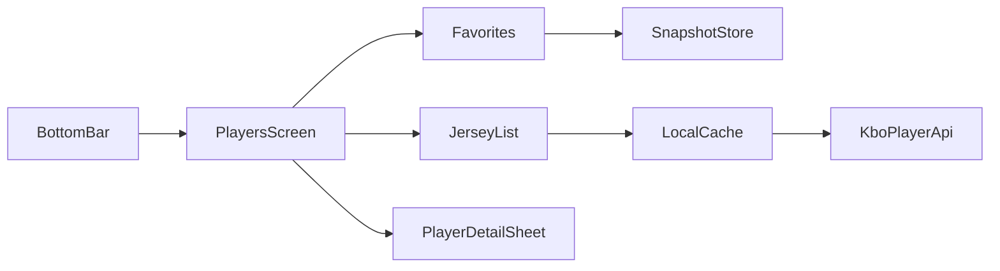

# 알림·결과·선수 탭 개선

회사 PC에서는 `git pull` 후 **이 파일**만 보면 된다. Cursor 홈 폴더 Plan은 집 PC에만 있다.

구현이 끝나면 버전은 [app/build.gradle.kts](app/build.gradle.kts) **2.0.8 / 2008**. [작업일지.md](작업일지.md)·[README.md](README.md)를 맞춘 뒤 테스트 → 커밋·푸시 → adb 설치.

---

## 1. 득점권 알림 문구

지금 [ScoreAlerts.kt](app/src/main/java/com/bossxor/lottegiants/domain/ScoreAlerts.kt) `formatScoringChanceAlert`는 **누가 어떻게 득점권이 됐는지**를 메인에 넣습니다. 주자 상황 + 타석을 메인에 두고, 상세에는 루별 주자·타석·**이닝·아웃**을 남깁니다.

구분은 쉼표가 아니라 **가운데 점 ` · `**. 주자 표기 `1,2루`처럼 루 숫자 사이의 쉼표만 유지합니다.

**메인 (title)**
- 만루: `만루 · 타석 장두성`
- 그 외: `주자 1,2루 · 타석 장두성` (점유한 루만 `1,2,3` 오름차순, 끝에 `루`)
- 예: 2루만 → `주자 2루 · 타석 …` / 1·3루 → `주자 1,3루 · 타석 …`

**상세 (text)** — who/how 제거, 이닝·아웃 유지
- `2루 나승엽 · 1루 한동희 · 타석 장두성 · 6회초 2아웃`
- 만루: `3루 레이예스 · 2루 나승엽 · 1루 한동희 · 타석 장두성 · 7회초 2아웃`
- 루 순서는 기존 `runnersLabel`처럼 **3루 → 2루 → 1루**

손댈 곳
- [ScoreAlerts.kt](app/src/main/java/com/bossxor/lottegiants/domain/ScoreAlerts.kt): `occupiedBasesLabel` 추가, `formatScoringChanceAlert`에 `on1/on2/on3` 전달. `inningLabel`/`outs`는 유지하고 `who`/`how`만 빼도 됨
- [EventDetector.kt](app/src/main/java/com/bossxor/lottegiants/live/EventDetector.kt) 258–297: `game.onBase1/2/3` 넘김. 트리거(득점권 진입·만루 진입)는 그대로
- [ScoreAlertsTest.kt](app/src/test/java/com/bossxor/lottegiants/domain/ScoreAlertsTest.kt): 기대 문자열 갱신
- [SnapshotStore.kt](app/src/main/java/com/bossxor/lottegiants/data/SnapshotStore.kt) `SCORING_CHANCE` 설명을 “주자 상황·타석”에 맞게 수정

---

## 2. 라이브 알림 투수·타자 이름 잘림 + BSO 세로

원인은 [notification_live.xml](app/src/main/res/layout/notification_live.xml) `notif_bso_row`에서 가로 BSO가 가운데를 차지하고 양쪽 `weight=1` + `maxLines=1` + `ellipsize=end`인 점입니다.

**수정:** BSO만 세로로 바꿉니다. 투수(왼쪽) · 타자(오른쪽) 배치는 유지합니다.

```
투수 스키모토 32구     B ○○○○     타자 5번 전민재
                     S ○○○
                     O ○○○
```

**정렬:** B/S/O 세 줄의 **왼쪽 시작점이 같아야** 한다. 글자 폭이 달라도 점(○) 열이 한 수직선에 오게 한다.

- 각 줄은 `가로 LinearLayout` (라벨 + 점들), 전체를 `세로 LinearLayout`
- B/S/O `TextView`는 **같은 `minWidth`**(또는 고정 width) + `gravity=center`, 점들의 `layout_marginStart`도 동일
- 가운데 폭이 줄어 이름 공간이 늘어남. 투수·타자는 `ellipsize`를 풀거나 `maxLines=2`
- [NotificationHelper.kt](app/src/main/java/com/bossxor/lottegiants/live/NotificationHelper.kt) 점 ImageView id(`notif_b0`…)는 그대로 바인딩
- 접힌 알림(`notification_live_compact.xml`)은 손대지 않음

---

## 3. 투수 교체 알림에 팀명

[EventDetector.kt](app/src/main/java/com/bossxor/lottegiants/live/EventDetector.kt) 210–215는 지금 `"$pitcherName 등판"`만 씁니다.

- **title:** `투수 교체` 유지
- **text:** `{팀명} - {투수이름}` (예: `KT - 스키모토`)
- 팀: `newPitcherCode in lottePitchers` → `game.focusName()`, `in opponentPitchers` → `game.opponentName`, 목록에 없으면 수비 팀(`!isLotteBatting`이면 내 팀)

---

## 4. 결과 탭 「전체」 LIVE 이닝 (내 팀·타팀)

[ResultsScreen.kt](app/src/main/java/com/bossxor/lottegiants/ui/screens/ResultsScreen.kt) 802–804가 LIVE일 때 `"LIVE"`만 그립니다. KBO `MiniGame.statusText`에는 이미 `"7회초"`가 들어 있습니다 ([KboOfficialApi.statusText](app/src/main/java/com/bossxor/lottegiants/data/KboOfficialApi.kt)).

표시: **모든 LIVE 경기**에 `LIVE · 7회초`. 내 팀만이 아니라 `otherGames`·전체 필터의 타팀도 동일.

- `statusText`에 `회`가 있으면 그대로 사용, 없으면 `LIVE`만
- [MainViewModel.kt](app/src/main/java/com/bossxor/lottegiants/ui/MainViewModel.kt) `toResultsMini()`는 LIVE일 때 `inningLabel`을 써서 내 팀 스냅샷도 이닝이 맞게 합쳐지게 함
- `mergeLive`는 타팀도 `otherGames`의 KBO `statusText`를 유지. `"진행 중"`처럼 이닝이 없는 값으로 덮어쓰지 않음

---

## 5. 타팀 경기 → 뒤로가기 = 결과 탭

지금은 결과에서 경기를 열면 [MainActivity.kt](app/src/main/java/com/bossxor/lottegiants/MainActivity.kt) 713–716이 `tab = 0`으로 바꾸고, 뒤로가기는 `viewingGame`만 지워 **라이브 탭에 남습니다**.

- 결과에서 열 때 `returnTab = 1` 저장 후 라이브 상세로 이동 (기존 `LiveScreen` 재사용)
- `BackHandler` / `onBackToLotte`에서 상세를 닫으면 `tab = returnTab` 후 플래그 클리어
- 하단 **라이브**를 직접 누르면 `returnTab`을 버려, 이후 뒤로가기가 결과로 튕기지 않게 함

타팀(`viewingGame != null`)이 핵심이고, 같은 경로로 연 오늘 내 팀 경기도 결과로 돌아가게 합니다.

---

## 6. 당일 등말소 없음 알림

[EventDetector.processRosterMoves](app/src/main/java/com/bossxor/lottegiants/live/EventDetector.kt)는 `moves.isEmpty()`면 바로 return합니다. **23시에 보내지 않습니다.**

등말소 알림은 원래 14시 이후 폴링에서 공시가 생기는 즉시 나갑니다. `변화 없음`도 그 흐름에 맞추고, **늦어도 라인업 알림과 같은 시점**에 보냅니다.

- **당일 실공시가 있으면** 기존처럼 즉시 등말소 알림. `변화 없음`은 보내지 않음
- **당일 공시가 계속 비어 있으면** [maybeNotifyLineup](app/src/main/java/com/bossxor/lottegiants/live/EventDetector.kt)이 라인업 알림을 보내는 순간에 `오늘 등말소 변화 없음`을 **하루 1회** 같이 보냄 (상한이자 기본 트리거)
- **당일 경기가 없어 라인업이 없으면** 등말소 감시가 시작된 뒤(14시) 공시가 비어 있음을 확인한 첫 폴링에서 1회 — 평소 등말소 알림을 기다리던 시각
- **문구:** title `엔트리 등말소`, text `오늘 등말소 변화 없음`
- **중복 방지:** DataStore 날짜 키 (예: `notified_roster_none_day`)

채널은 기존 `ROSTER`를 씁니다.

---

## 7. 하단 「선수」 탭 (결과와 순위 사이)

Compose 단일 액티비티라 XML bottom nav는 없습니다. [CompactBottomBar](app/src/main/java/com/bossxor/lottegiants/MainActivity.kt) 탭을 5개로 늘립니다.

`라이브(0) · 결과(1) · 선수(2) · 순위(3) · 설정(4)`

딥링크는 문자열을 우선합니다. `standings`/`settings`는 새 인덱스로, 숫자 `"2"`/`"3"`만 쓰던 경로는 깨지지 않게 `standings`/`settings` 키를 유지합니다.

**화면** — 신규 [PlayersScreen.kt](app/src/main/java/com/bossxor/lottegiants/ui/screens/PlayersScreen.kt)

- 위: **즐겨찾기** (설정에서 옮김 — 목록, 삭제, 검색/추가, 상세 시트·☆)
- 아래: **등번호 일람표** — 결과 탭과 같은 팀 칩, 이름/등번호 검색, 등번호 오름차순, 포지션 표시
- 선수 탭에서 불러오도록 `onNeedPlayersTab()` 추가

**설정** — [SettingsScreen.kt](app/src/main/java/com/bossxor/lottegiants/ui/screens/SettingsScreen.kt)의 「즐겨찾기 선수」 블록 제거. `toggleFavorite` / DataStore는 그대로 두고 선수 탭에서만 관리합니다.

**데이터·캐시:** 팀별 전체 등번호는 매번 네트워크로 받지 않습니다.

- 첫 로드: KBO 공식 선수 검색에서 `등번호·이름·포지션·playerCode`를 받아 [SnapshotStore](app/src/main/java/com/bossxor/lottegiants/data/SnapshotStore.kt)에 **팀+시즌 단위로 저장**
- 이후 탭 진입: **저장된 목록을 바로 보여 주고**, 백그라운드에서만 다시 조회
- 조회 결과가 캐시와 다르면(등번호·이름·포지션·인원 차이) 저장을 덮고 UI를 갱신. 같으면 네트워크 결과만 버리고 화면은 유지
- 당겨서 새로고침은 강제 비교
- 코드가 비면 기존처럼 이름+Keubo 스탯으로 보강



---

## 문서 · 테스트 · 배포

테스트가 실패하면 **커밋·푸시·adb 설치를 하지 않는다.**

1. 기능 구현 후 [작업일지.md](작업일지.md) 최상단에 **구현한 날짜 / 2.0.8**과 변경 요약을 넣는다. 「현재 상태」 버전·실기를 2.0.8 / 2008로 맞춘다.
2. [README.md](README.md)를 같은 버전에 맞춘다.
   - 하단 탭: `라이브 · 결과 · 선수 · 순위 · 설정`
   - 설정에서 즐겨찾기 선수 항목을 빼고, 선수 탭(등번호 일람·즐겨찾기·검색)을 적는다
   - 득점권 예시, 등말소 `오늘 등말소 변화 없음`, 라이브 알림 BSO 세로, 결과 LIVE 이닝
3. `.\scripts\env.ps1` 후 `.\gradlew.bat :app:testDebugUnitTest`
4. 통과하면 커밋 (`why` 위주, APK·build 제외) → `git push origin HEAD`
5. 로컬 릴리스 APK를 `%TEMP%`로 복사한 뒤 실기 설치

```powershell
.\scripts\env.ps1
.\gradlew.bat :app:testDebugUnitTest
.\scripts\build.ps1 -Type release
Copy-Item "app\build\outputs\apk\release\app-release.apk" "$env:TEMP\LotteGiants.apk" -Force
adb -s R5KL10FHTTN install -r $env:TEMP\LotteGiants.apk
```

NAS 경로에서 `adb install`이 걸리면 TEMP 복사를 꼭 쓴다. `INSTALL_FAILED_UPDATE_INCOMPATIBLE`이면 `adb uninstall com.bossxor.lottegiants` 후 같은 APK로 다시 설치.

---

## 작업 순서

알림·결과 수정(1–6)을 먼저 넣고 테스트를 고친 뒤, 선수 탭(7)을 붙입니다. 마지막에 문서·테스트·커밋·푸시·adb입니다.
