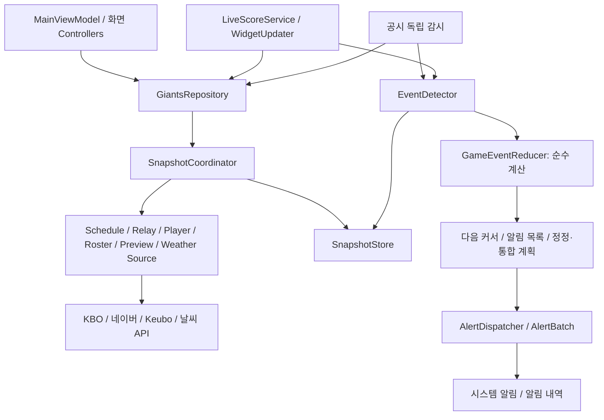

# 조회·알림·화면 상태 구조 (2.0.60)

Gradle 모듈은 기존 `app` 하나를 유지한다. 책임별 클래스로 실행 흐름과 상태 소유자를 구분한다.

## 조회와 게시

`SnapshotCoordinator`는 전체(FULL)와 경기(LIVE) 요청을 구분한다. 같은 종류·팀·선택 경기·날짜의 진행 중 요청은 공유한다. 네트워크 조회는 게시 잠금 밖에서 실행한다. 디스크와 메모리 게시만 직렬화한다.

요청 세대·팀·선택 경기·KBO 날짜를 게시 전에 확인한다. DataStore 저장 트랜잭션에서도 선택을 다시 확인한다. 늦게 끝난 전체 조회는 이미 게시한 최신 경기 점수·이닝·중계에 보조 데이터를 합친다. 중계 seqno가 뒤로 가는 응답도 최신 경기를 덮지 않는다. DH 경기 전환 후 이전 경기 응답도 차단한다.

화면의 자동 LIVE 갱신은 서비스와 같은 경량 경로를 사용한다. 전체 보조 조회는 별도 작업에서 최대 1분 간격으로 보완한다. LIVE의 갱신 시각으로 FULL 자료의 신선도를 연장하지 않는다. 강제 새로고침은 완료 값 재사용을 건너뛴다.

## 자료별 소유권

| 소유자 | 책임과 정책 |
|---|---|
| ScheduleSource | 날짜별 일정 캐시(당일 30초, 과거 10분), 범위 요청 최대 6개, 시즌 창 10분, 동일 요청 공유 |
| RelaySource | 라이브·상세·라인업 원본 요청 공유, 이닝 캐시·누락 복구, 한 조회에서 지난 이닝 최대 3개, 최대 12경기 캐시, 세대별 무효화 |
| PlayerSource | 선수 상세·시즌 기록·프로필 결합과 동일 상세 요청 공유 |
| RosterSource | 공식 등록·말소 조회와 선수 목록; 당일 공시는 완료 값 TTL 0으로 매번 확인, 과거 날짜는 10분 캐시, Keubo 이력 10분 |
| PreviewSource | 경기별 프리뷰 5분 캐시와 진행 중 요청 공유 |
| WeatherSource | 구장별 날씨 15분 캐시와 진행 중 요청 공유 |
| SingleFlight | 진행 중 같은 키 요청 공유; 대기자 취소는 소유자를 취소하지 않음. 소유자 실패·취소는 대기자에게 전달하고 다음 요청은 재시도 가능 |
| TimedSourceCache | 자료별 TTL과 최대 캐시 항목 수; 실패는 캐시하지 않음 |

라인업·등말소 감시의 독립 루프, 당일 신선 조회, 10/30/60초 정책과 실패를 ‘변화 없음’으로 처리하지 않는 원칙은 유지한다.

## 이벤트와 정책

`GameEventReducer.reduce`는 이전 `LiveEventCursor`, 현재 경기, 즐겨찾기와 타석 변경 설정으로 다음 상태·알림·통합 취소 목록을 반환한다. Android, DataStore, 네트워크를 호출하지 않는다. 득점 ID, 지연 상세의 무음 보완과 정정 처리도 계산 결과에 포함한다.

`EventDetector`는 경기/라인업/등말소/레이스의 잠금을 구분하고 저장·중복 방지와 종료 알림 순서를 관리한다. `AlertDispatcher`는 배치 시작 시 정책을 한 번 읽는다. `AlertBatch`는 명시적으로 받은 LIVE 여부로 정책을 적용하고 시스템 알림과 내역을 발행한다. 다른 작업이 공유 LIVE 플래그를 임시로 변경하는 방식은 제거했다. 득점/리드 알림의 진동 설정도 배치에서 전달하므로 발행 중 설정 조회를 위한 runBlocking을 추가하지 않는다.

복구 커서는 이름·숫자·불리언·주자·득점 원장을 가진 typed JSON이다. 파이프 문자열과 2.0.59 `parts` 배열 JSON도 읽는다. 이후 저장은 새 형식이며 원장과 무음 보완 상태를 보존한다.

## 화면 요청

`PlayerDetailController`, `PlayerRosterController`, `CalendarController`, `EntryController`가 상세·팀 선수 목록·일정·엔트리의 요청/상태를 소유한다. `LatestRequest`는 선택 변경 시 이전 작업을 취소하고 게시 직전 취소와 세대를 다시 확인한다. 이전 조회가 취소를 삼켰더라도 새 선택을 덮지 않는다. 이전 작업의 finally도 새 작업의 로딩 상태를 끄지 않는다.

MainViewModel은 기존 공개 화면 API를 유지하고 담당 객체의 상태를 연결한다. 라이브 스냅샷을 결과 목록에 합치는 표시 로직은 MainViewModel에 남긴다.

## 검증과 한계

단위 테스트는 기존 177개에 동시 요청·늦은 응답·선택 변경·취소·TTL·커서 이행·새 reducer의 실제 경기 재생을 추가했다. 실제 LG–롯데전의 공개 중계 519개 문구를 한 문구씩 처리하고 매번 커서를 직렬화/복구해 득점 원장 및 중복 방지를 확인한다.

| 비교 항목 | 이전 구조 | 현재 검증 |
|---|---|---|
| 전체 네트워크 조회가 멈춘 동안 LIVE | 같은 refreshMutex 대기 | gated FULL이 미완료 상태여도 LIVE 게시 완료 |
| 동시 동일 경량 요청 20개 | 직렬 대기 후 4초 캐시 재사용 | 같은 진행 중 요청 1회·게시 1회로 공유 |
| 알림 정책 조회 | 알림별 종류·LIVE 전용·무음 등 6회, 득점/리드 진동 별도 | 배치 시작 시 DataStore 1회, 진동 전달 |
| 오래된 화면 요청 | 일부 요청만 Job 취소, 취소를 삼킨 결과 게시 가능 | 취소·세대 확인 후 게시, 닫기/선택 변경 회귀 테스트 |
| 파일별 책임 집중 | Repository 1,628 / Detector 900 / ViewModel 934줄 | 책임을 별도 클래스로 이동; 전체 코드 양 감소를 성능 지표로 사용하지 않음 |

이 비교는 코드 경로와 가짜 지연을 사용한 동시성 검증이다. 실제 API 속도가 몇 % 빨라졌다는 측정은 하지 않았다. 외부 공시 발행 속도와 Android 절전의 영향, 다음 실제 LIVE 경기의 종단 간 지연은 현장 확인이 필요하다.
